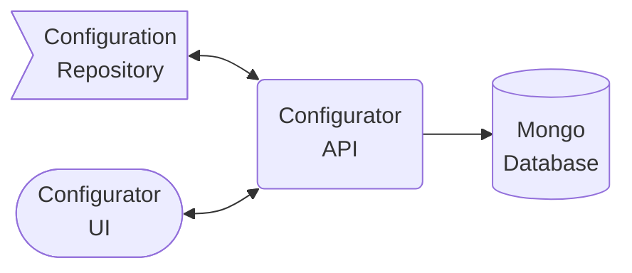

# MongoDB Configurator

The MongoDB Configurator is a utility for creating and managing versioned MongoDB configurations, specifically schema validation, indexing. As a data engineer working with MongoDB across multiple use cases, from backing APIs in various languages to automated data ingestion pipelines and change data capture solutions, you need centralized data quality constraints that go beyond domain-specific tools like ODMs. The Configurator helps you define data quality constraints using a simplified schema approach that configures MongoDB Schema Validation, test your configurations locally, then package them for independent deployment. See the Configurator [SRE Guide](./SRE.md) for deployment details. 


## Quick Start

### A Note about using the Playground
If you think you will want to save your configurations, you should create your own configuration repository by creating a new GitHub repo using [this Template](https://github.com/agile-learning-institute/mongodb_configurator_template), and follow the getting started there.

### Prerequisites
- [Docker Desktop](https://docs.docker.com/get-started/get-docker/) - it's free (for personal use)
- [MongoDB Compass](https://www.mongodb.com/try/download/compass) - Optional
  - Playground connection string: `mongodb://localhost:27017/`

### Configurator Install

Use the commands below to download this [docker-compose](./docker-compose.yaml) file and run the Configurator. Then visit http://localhost:8082 to access the Configurator. 

```bash
mkdir ~/Configurator
cd ~/Configurator
curl https://raw.githubusercontent.com/agile-learning-institute/mongodb_configurator/refs/heads/main/docker-compose.yaml -o docker-compose.yaml
docker compose up -d
```

### Shutdown
When you are done playing, you can use this command to shut down the service.
```bash
docker compose down
```

**Note**: Shutting down the service will reset the playground to its starting state. If you want to save all the files you have created in the playground, see [the API Explorer](http://localhost:8081/docs/index.html) for information on API commands you can use to get the documents. 

--- 

### Troubleshooting
First, make sure you have the latest containers with
```bash
docker compose pull
```

The playground service needs ports 27017, 8081, and 8082 to be available. 

### Support Community 
Feel free to open an issue and request a review on any of the repo's. You can find suppot on Discord in [this channel](https://discord.gg/VvBe6BrCbb) on the Agile Learning Institute's server.

