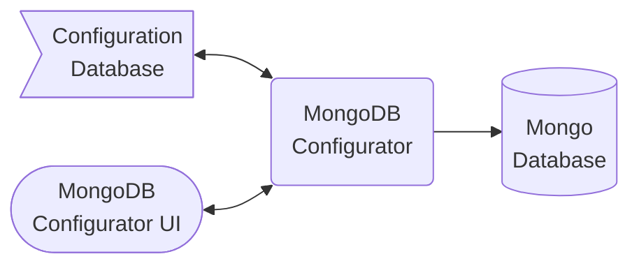

# The MongoDB Configurator

The MongDB Configurator is a utility for creating and managing Versioned MongoDB Configurations, specifically schema validation, indexing, and version migrations when needed. The configurator provides a containerized packaging of database configurations, and a web application that makes it easy to create and test those configurations. 

## Configurator Components

## Quick Start
- Use the [MongoDB Configurator Template](https://github.com/agile-learning-institute/mongodb_configurator_template) to create your Configuration Database repository, then follow the instructions in the README.

## Documentation
- Configurator [Reference](./REFERENCE.md) 
- [Simple Schema](./SIMPLE_SCHEMA.md) Standard
